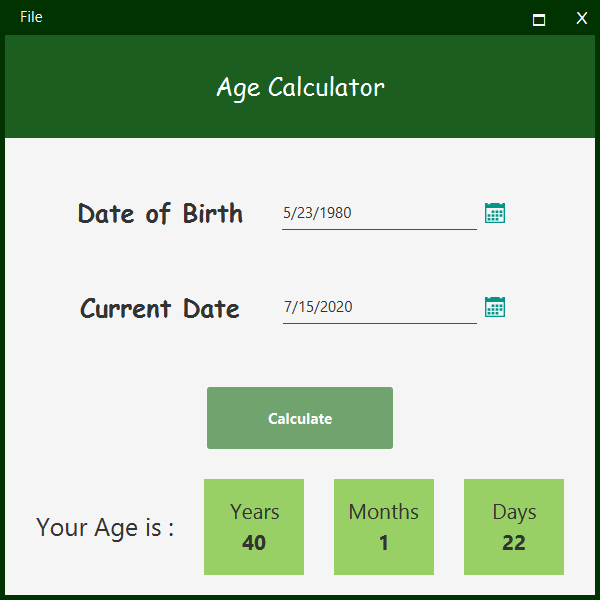

# Age Calculator - JavaFX

 <strong>
 The Age Calculator can determine the age or interval between two dates. The calculated age will be displayed in years, months, weeks and days. 
</strong>

## Getting Started

- To run this Project use **[AgeCalcApp.java](/AgeCalculator-JavaFX/src/age/calculator/main/AgeCalcApp.java)**.

## Requirements
* Java +8

## Tools & Technologies

- [FontawesomeFX 8.9](https://bitbucket.org/Jerady/fontawesomefx/src/master/) for Icons
- [Jfoenix 8.9](http://www.jfoenix.com/) library is an open source Java library, that implements Google Material Design using Java components .

## Thank You!
Please ⭐️ this repo and share it with others

 

----

<h6 align="center">سبحَانَكَ اللَّهُمَّ وَبِحَمْدِكَ، أَشْهَدُ أَنْ لا إِلهَ إِلأَ انْتَ أَسْتَغْفِرُكَ وَأَتْوبُ إِلَيْكَ</h6>

